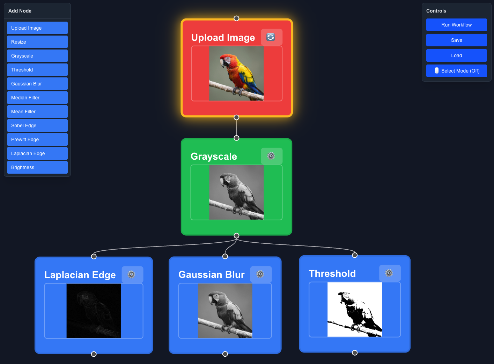

# Vision Flow (Nocode Web App)

A node-based visual workflow editor for image processing. Build powerful image manipulation pipelines by connecting nodes without writing any code.




## 🌟 Features

- **Visual Workflow Editor**: Drag-and-drop node-based interface powered by React Flow
- **Real-time Preview**: See image processing results instantly on each node
- **Multiple Filters**: Gaussian Blur, Median Filter, Mean Filter, Grayscale, Brightness adjustment, Threshold, Sobel, Prewitt, Laplacian edge detection
- **Configurable Parameters**: Adjust filter settings with intuitive sliders and inputs
- **Image Viewer**: Full-screen viewer with zoom (0.1x - 5x), pan, and resolution display
- **Workflow Persistence**: Save and load workflows as JSON files
- **Select Mode**: Multi-select nodes by dragging for batch operations
- **Custom Node Colors**: Right-click on any node to change its color (10 colors available)
- **AI Assistant Chat**: Built-in AI chat support to help with workflow creation and image processing questions
- **Dark Theme**: Modern dark UI for comfortable extended use

## 🚀 Quick Start

### Prerequisites

- Node.js 18+ 
- Python 3.10+
- [uv](https://github.com/astral-sh/uv) (Python package manager)

### Installation

```bash
# Clone the repository
git clone https://github.com/tt-git-1/visionflow.git
cd visionflow
```

### Backend Setup

```bash
cd backend

# Create virtual environment with uv
uv venv

# Install dependencies
uv pip install -r requirements.txt

# Start the server
uv run python main.py
```

The backend will run on `http://localhost:8000`

### Frontend Setup

```bash
cd frontend

# Install dependencies
npm install

# Start development server
npm run dev
```

The frontend will run on `http://localhost:3000`

## 📖 Usage Guide

### 1. Add Nodes

Click nodes from the left sidebar to add them to your workspace:
- **Upload Image**: Click to upload an image file
- **Resize**: Change image dimensions
- **Grayscale**: Convert to black and white
- **Threshold**: Binary threshold filter (0-255)
- **Gaussian Blur**: Apply Gaussian blur with adjustable kernel size
- **Median Filter**: Remove noise while preserving edges
- **Mean Filter**: Apply uniform averaging blur
- **Sobel Edge**: Sobel edge detection
- **Prewitt Edge**: Prewitt edge detection
- **Laplacian Edge**: Laplacian edge detection
- **Brightness**: Adjust image brightness (0x - 2x)

### 2. Connect Nodes

Drag from the bottom handle of one node to the top handle of another to create connections. Images flow from left to right through your workflow.

### 3. Configure Parameters

Click the ⚙️ icon on any processing node to open settings:
- **Resize**: Set custom width and height
- **Threshold**: Adjust threshold value (0-255)
- **Gaussian Blur**: Adjust kernel size (3-21)
- **Median Filter**: Adjust kernel size (3-15)
- **Mean Filter**: Adjust kernel size (3-21)
- **Brightness**: Slide between 0x (dark) and 2x (bright)

### 4. Run Workflow

Click **"Run Workflow"** in the top-right controls panel to execute your pipeline. Results appear on each node automatically.

### 5. View & Export

- **Click any node** with an image to open the full-screen viewer
- **Zoom**: Scroll wheel (0.1x - 5x)
- **Pan**: Click and drag
- **Save**: Download processed images as PNG

### 6. AI Assistant

The chat panel at the bottom of the screen provides AI assistance for:
- Explaining image processing techniques
- Helping with workflow creation
- Answering questions about filter algorithms

To use it, ensure a local LLM server is running (e.g., LM Studio), then type your question and press Enter to send.

**Chat Settings**: Click the **⚙️ Chat Settings** button in the Controls panel (top-right) to configure the OpenAI API compatible URL. Default: `http://localhost:1234/v1`

## 🔧 Available Nodes

| Node | Description | Parameters |
|------|-------------|------------|
| Upload Image | Load image from file | - |
| Resize | Change dimensions | Width, Height |
| Grayscale | Convert to B&W | - |
| Threshold | Binary threshold filter | Threshold (0-255) |
| Gaussian Blur | Smooth blur effect | Kernel Size (3-21) |
| Median Filter | Noise reduction | Kernel Size (3-15) |
| Mean Filter | Uniform averaging | Kernel Size (3-21) |
| Sobel Edge | Sobel edge detection | Direction (magnitude/horizontal/vertical), Kernel Size (3) |
| Prewitt Edge | Prewitt edge detection | Direction (magnitude/horizontal/vertical) |
| Laplacian Edge | Laplacian edge detection | Kernel Size (3), Apply Threshold, Threshold Value |
| Brightness | Adjust brightness | Factor (0x - 2x) |

## 🎨 Custom Node Colors

Right-click on any node to open a color picker menu. Choose from 10 different colors to customize your workflow visual appearance. The custom color persists when saving and loading workflows.

## 🛠️ Tech Stack

### Frontend
- **Next.js 16** - React framework with App Router
- **TypeScript** - Type-safe development
- **React Flow** - Node-based workflow editor
- **Tailwind CSS** - Utility-first styling

### Backend
- **FastAPI** - Modern Python API framework
- **OpenCV (cv2)** - Computer vision and edge detection
- **Pillow (PIL)** - Image processing library
- **NumPy** - Numerical computations
- **SciPy** - Advanced image filters

## 📝 API Endpoints

```
POST   /api/nodes/execute      # Execute a node with parameters
GET    /api/workflows          # List all workflows
POST   /api/workflows          # Create new workflow
GET    /api/workflows/{id}     # Get workflow by ID
PUT    /api/workflows/{id}     # Update workflow
DELETE /api/workflows/{id}     # Delete workflow
POST   /api/images/upload      # Upload image file
```

